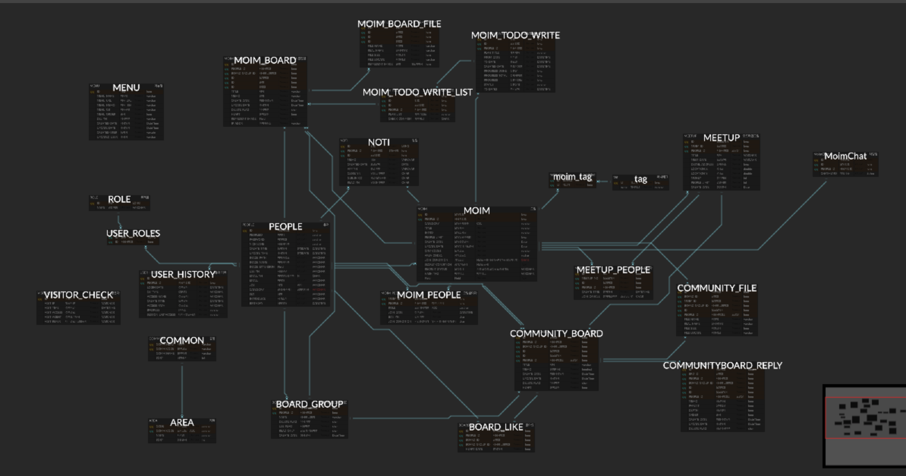

# DAYARY
개발환경 
language:Java1.8 
framework:spring boot 2.1.x  and gradle 
orm:JPA 
view:thymeleaf 
database: mariadb

주제:
스터디 및 모임을 찾는 사이트

erd:https://www.erdcloud.com/d/K3yd7YMxYKrprE9L7
</img>
</img>
</img>

스프링 시큐리티
타임리프

기능정의  
->회원 
1.- [x]회원가입 
2.- [x]회원수정 
3.- [x]회원삭제 
4.- [x]회원조회 
5.- [x]로그인-권한에 따라 분기처리 
 
-모임 
1.- [x]모임리스트 조회 
2.- [x]모임만들기 
3.- [x]모임삭제 
4.- [x]모임 수정 
5.- [x]모임 비회원가입 
6.- [x]모임 회원탈퇴 
7.- [x]모임회원 강퇴 
8.- [x]모임회원 승인여부 처리 
9.- [x]모임 해시태그 
10.- [x]모임 검색기능 해시태그및 일반 이름으로 가능  
11.- [x]모임 카테고리별 주제 기능 조회 
12.- [x]모임 사진첨부 기능 
13.- [x]모임 채팅 (stomp로 실시간 구현) 
14.- [x]모임 오프라인 미팅 조회 
15.- [x]모임 오프라인 미팅 만들기(지도 api구현) 
16.- [x]모임 오프라인 미팅 삭제 
17.- [x]모임 오프라인 회원 참여 
18.- [x]모임 오프라인 회원 참여 취소 

-모임 내 투두리스트
1.- [x]투두리스트 작성 
2.- [x]투두리스트 삭제 
3.- [x]투두리스트 날짜 수정 

-게시판
1.- [x]게시판작성 
2.- [x]게시판수정 
3.- [x]게시판 단건 조회 
4.- [x]게시판 리스트조회 
5.- [x]게시판 삭제 
6.- [x]좋아요 기능 
7.- [x] 좋아요 기능 취소 

-알림처리 
알림처리는 websocket에 stomp로 처리하였음
